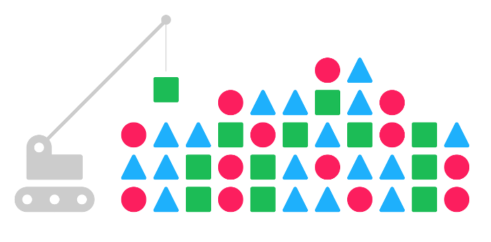

:title: Deis Docs | Your PaaS. Your Rules.
:description: Welcome to Deis

Welcome
=======

**Deis** is an open source PaaS that makes it easy to deploy, scale and manage
containers used to host applications and services. Deis builds on `Docker`_ and
`CoreOS`_ to provide a private PaaS that is lightweight and flexible.

If you are new to Deis, start with :ref:`Concepts` and basic :ref:`Usage` of
the command-line client. Follow the :ref:`Developer Guide <developer>` to
deploy an application on Deis. The :ref:`Operations Guide <operations>` will
guide you through deploying Deis itself.

Want to learn about Deis internals?  You'll find complete API documentation
in the :ref:`client` and :ref:`server` sections.

Interested in contributing to the Deis project?  Check out our
:ref:`Contributor Overview <contributor>` and
:ref:`localdev` instructions.

.. _`Docker`: https://www.docker.io/
.. _`CoreOS`: https://coreos.com/

