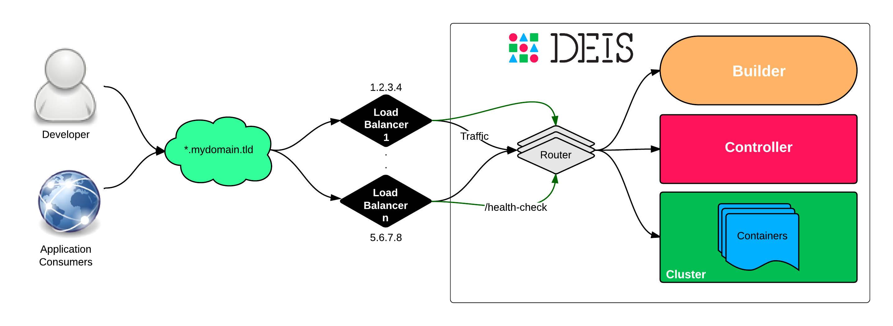

:title: Configure Load Balancers
:description: Configure load balancers for your Deis Cluster

.. _configure-load-balancers:

Configure Load Balancers
------------------------

Deis includes multiple routers scheduled to the cluster as part of the router mesh.
In the event of a host failure, these routers can move hosts.
Therefore, it is recommended that you configure a load balancer
to operate in front of the Deis cluster to serve application traffic.

These ports need to be open on the load balancers:

* 80 (for application traffic and for API calls to the controller)
* 2222 (for traffic to the builder)

If you want to configure SSL termination on your load balancer, see :ref:`platform_ssl`.

A health check should be configured on the load balancer to send an HTTP request to /health-check at
port 80 on all nodes in the Deis cluster. The health check endpoint returns an HTTP 200. This enables
the load balancer to serve traffic to whichever hosts happen to be running the deis-router component
at any moment.

EC2
===

The Deis provisioning scripts for EC2 automatically create an Elastic Load Balancer for your Deis
cluster.

Rackspace
=========

You'll need to create two load balancers on Rackspace, as follows:

.. code-block:: text

    Load Balancer 1
      Port 80
      Protocol HTTP
    Health Monitoring -
      Monitor Type HTTP
      HTTP Path /health-check

    Load Balancer 2
      Virtual IP Shared VIP on Another Load Balancer (select Load Balancer 1)
      Port 2222
      Protocol TCP

Google Compute Engine
=====================

The provisioning instructions for `Google Compute Engine`_ include steps to create a load balancer.
It is not possible to change the timeout of the load balancer in Google Compute Engine at the moment.

.. _`Google Compute Engine`: https://github.com/deis/deis/tree/master/contrib/gce#readme
