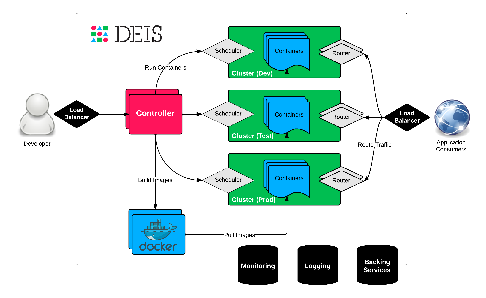

:title: Architecture
:description: Architecture of the Deis application platform (PaaS)

.. _architecture:

Architecture
============

.. TODO: Need a caption for the Deis architectural diagram

Deis consists of 7 components that combine to create a distributed PaaS.
Each Deis component is deployed as a :ref:`Container`.

.. _arch_controller:

Controller
----------
The :ref:`controller <Controller>` component is a RESTful API server
written with `Django`_ and `Celery`_. Command-line clients interact with
this component.

.. _database:

Database
--------
The database component is a `PostgreSQL`_ server used to store durable
platform state. Backups and WAL logs are pushed to :ref:`Store`.

.. _cache:

Cache
-----
The cache component uses `Redis`_ to:

 * Store work queue data for `Celery`_
 * Cache sessions and synchronize locks for `Django`_
 * Store recent log data for the :ref:`Controller`

.. _builder:

Builder
-------
The builder component uses a `Git`_ server to process
:ref:`Application` builds. The builder:

 #. Receives incoming ``git push`` requests over SSH
 #. Authenticates the user via SSH key fingerprint
 #. Authorizes the user's access to write to the Git repository
 #. Builds a new `Docker` image from the updated git repository
 #. Adds the latest :ref:`Config` to the resulting Docker image
 #. Pushes the new Docker image to the platform's :ref:`Registry`
 #. Creates a new :ref:`Release` on the :ref:`Controller`

Once a new :ref:`Release` is generated, a new set of containers
is deployed across the platform automatically.

.. _registry:

Registry
--------
The registry component hosts `Docker`_ images on behalf of the platform.
Image data is stored by :ref:`Store`.

.. _logger:

Log Server
----------
The log server component uses `rsyslog`_ to aggregate log data from
across the platform.
This data can then be queried by the :ref:`Controller`.

.. _router:

Router
------
The router component uses `Nginx`_ to route traffic to
application containers.

.. _store:

Store
------
The store component uses `Ceph`_ to store data for Deis components
which need to store state (namely :ref:`Registry` and :ref:`Database`).

.. _`Amazon S3`: http://aws.amazon.com/s3/
.. _`Celery`: http://www.celeryproject.org/
.. _`Ceph`: http://ceph.com
.. _`Django`: https://www.djangoproject.com/
.. _`Docker`: http://docker.io/
.. _`etcd`: https://github.com/coreos/etcd
.. _`Git`: http://git-scm.com/
.. _`Nginx`: http://nginx.org/
.. _`OpenStack Storage`: http://www.openstack.org/software/openstack-storage/
.. _`PostgreSQL`: http://www.postgresql.org/
.. _`Redis`: http://redis.io/
.. _`rsyslog`: http://www.rsyslog.com/
