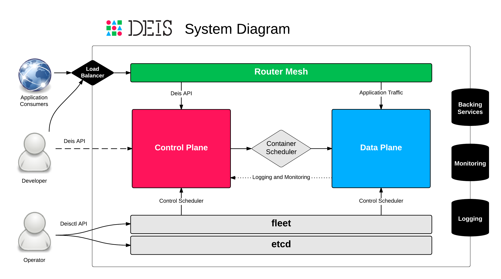
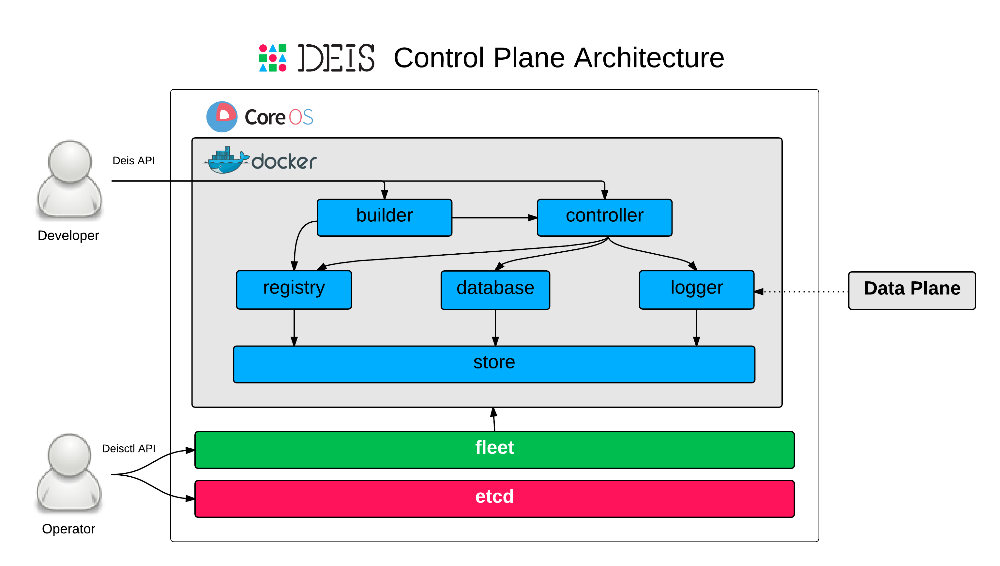
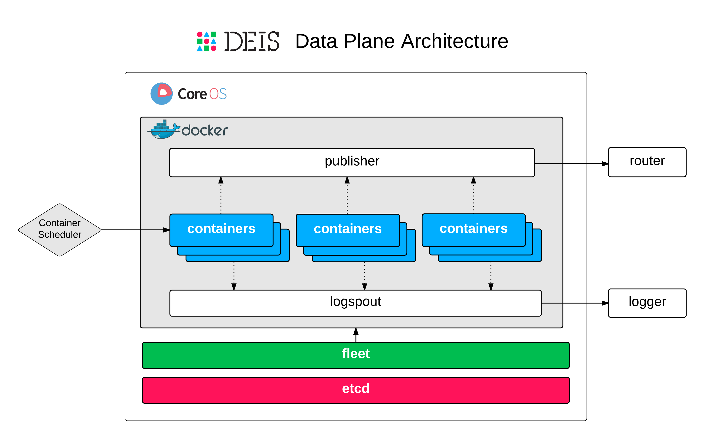

:title: Architecture
:description: Architecture of the Deis application platform (PaaS)

.. _architecture:

Architecture
============

Deis uses a service oriented architecture with :ref:`components`
grouped into a Control Plane, Data Plane and Router Mesh.

.. _system-diagram:

System Diagram
--------------

Operators use the ``Deisctl API`` to stand up the cluster's Control Plane, Data Plane and Router Mesh.
End-users of the platform interact with the Control Plane using the ``Deis API``.

The Control Plane dispatches work to the Data Plane via a scheduler.
The Router Mesh is used to route traffic to both the Control Plane and Data Plane.
Because the router mesh is usually connected to the public Internet,
it is often connected to a front-end load balancer.

.. _control-plane:

Control Plane
-------------

The Control Plane performs management functions for the platform.
Control plane components (in blue) are all implemented as Docker containers.

The :ref:`store` component consists of a number of smaller components that represent a
containerized Ceph cluster which provides a blob storage API and POSIX filesystem API
for the control plane's stateful components:

 * :ref:`registry` - a Docker registry used to hold images and configuration data
 * :ref:`database` - a Postgres database used to store platform state
 * :ref:`logger` - a syslog log server that holds aggregated logs from the data plane

End-users interact primarily with the :ref:`comp_controller` which exposes an
HTTP API. They can also interact with the :ref:`builder` via ``git push``.

.. _data-plane:

Data Plane
----------

The Data Plane is where :ref:`Containers <container>` (in blue) are run on behalf of end-users.

The platform scheduler is in charge of placing containers on hosts in the data plane.
Deis also requires a few lightweight components on these hosts:

 * :ref:`publisher` - publishes end-user containers to the :ref:`router`
 * :ref:`logspout` - feeds log data to the Control Plane :ref:`logger`

.. _topologies:

Topologies
----------

For small deployments you can run the entire platform
-- Control Plane, Data Plane and Router Mesh -- on just 3 servers.
For larger deployments, you'll want to isolate the Control Plane and Router Mesh,
then scale your data plane out to as many servers as you need.
