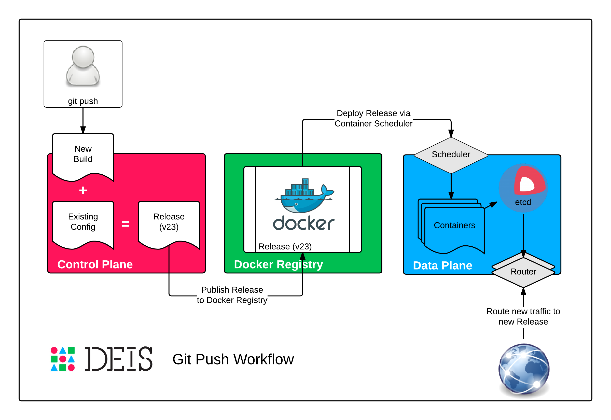

:title: Concepts
:description: Deis scales Twelve-Factor apps as containers over a cluster of machines.

.. _concepts:

Concepts
========
Deis is a lightweight application platform that deploys and scales
:ref:`concepts_twelve_factor` apps as :ref:`concepts_docker` containers
across a cluster of :ref:`concepts_coreos` machines.

.. _concepts_twelve_factor:

Twelve-Factor
-------------
The `Twelve-Factor App`_ is a methodology for building modern
applications that can be scaled across a distributed system.

We consider it an invaluable synthesis of much experience with
software-as-a-service apps in the wild, especially on the
Heroku platform.

Deis is designed to run applications that adhere to `Twelve-Factor App`_
methodology and best practices.

.. _concepts_docker:

Docker
------
`Docker`_ is an open source project to pack, ship and run any
application as a lightweight, portable, self-sufficient container.

Deis curates your applications as Docker images, which are then
distributed across your cluster as Docker containers.

(Deis itself is also a set of coordinated Docker containers.)

.. _concepts_coreos:

CoreOS
------
`CoreOS`_ is a new, minimal Linux distribution, rearchitected for
running modern, containerized infrastructure stacks.

Deis runs on CoreOS machines that can be hosted anywhere -- public cloud,
private cloud, bare metal or even your workstation.

CoreOS allows Deis to host applications and services at scale with
high resilience, in a way that is simple to operate.

.. _concepts_applications:

Applications
------------
Deis is designed around the concept of an :ref:`application`, or app.
Applications live on a cluster where they use :ref:`Containers <container>`
to service requests.

Developers use applications to push code, change configuration, scale processes,
view logs, run admin commands and much more.

.. _concepts_build_release_run:

Build, Release, Run
-------------------

Build Stage
^^^^^^^^^^^
The :ref:`builder` processes incoming ``git push`` requests and builds applications
inside ephemeral Docker containers, resulting in a new Docker image.

Release Stage
^^^^^^^^^^^^^
During the release stage, a :ref:`build` is combined with :ref:`config` to create a new numbered
:ref:`release`. This release is then pushed to a Docker registry for later execution.
The release stage is triggered any time a new build is created or config is
changed, making it easy to rollback code and configuration changes.

Run Stage
^^^^^^^^^
The run stage dispatches containers to a scheduler and updates the router accordingly.
The scheduler is in control of placing containers on hosts and balancing them evenly across the cluster.
Containers are published to the router once they are healthy.  Old containers are only collected
after the new containers are live and serving traffic -- providing zero-downtime deploys.

.. _concepts_backing_services:

Backing Services
----------------
Deis treats databases, caches, storage, messaging systems, and other
`backing services`_ as attached resources, in keeping with Twelve-Factor
best practices.

Applications are attached to backing services using `environment variables`_.
Because applications are decoupled from backing services, apps are free to scale up independently,
to swap services provided by other apps, or to switch to external or third-party vendor services.

See Also
--------
* :ref:`Architecture`
* :ref:`Using Deis <using_deis>`
* :ref:`Managing Deis <managing_deis>`
* `Twelve-Factor App`_

.. _`Twelve-Factor App`: http://12factor.net/
.. _`Docker`: http://docker.io/
.. _`CoreOS`: https://coreos.com/
.. _`Build and Run`: http://12factor.net/build-release-run
.. _`backing services`: http://12factor.net/backing-services
.. _`environment variables`: http://12factor.net/config
